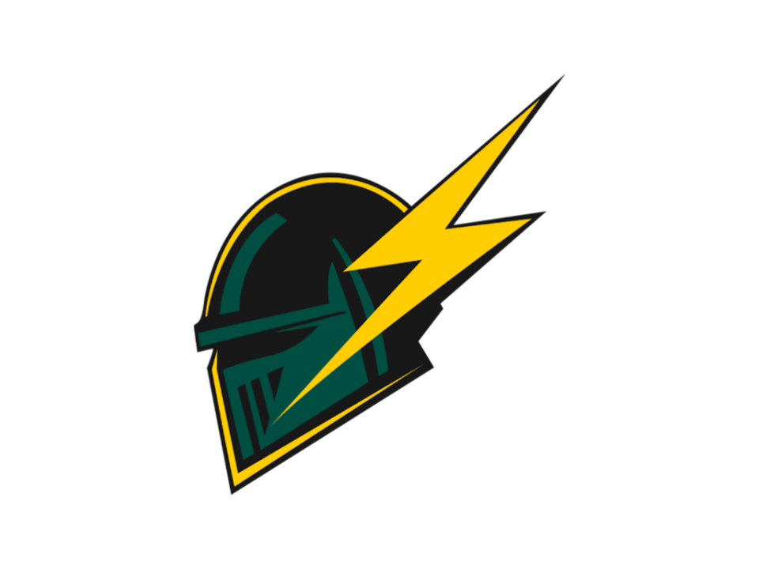

# Subteam page handoff — building on the High Voltage template

This documents how [subteams/high-voltage.html](../subteams/high-voltage.html) is built so another agent can bring
the other 11 subteam pages (Low Voltage, Chassis, Drivetrain, Suspension, Vehicle Dynamics,
Brakes, Cooling, Ergo, Aerodynamics, Composites, Business) up to the same format. It currently
still lists real content — read it directly for the up-to-date reference, not this doc.

**Read [DESIGN.md](DESIGN.md) and [PRODUCT.md](PRODUCT.md) first.** This file only covers
mechanics; those two are the binding source of truth for the visual system and content rules.

## Hard constraint — do not skip this

**Never invent subteam-specific facts, specs, achievements, or image captions.** Every fact on
the High Voltage page (part numbers, voltages, architectures, what's shown in each photo) came
directly from the team, confirmed via clarifying questions before any copy was written. Before
writing a new subteam page:

1. Ask the subteam for real specs, current focus, and any photos/video they want to use.
2. If photos are provided, confirm what is actually depicted before writing a caption — don't
   guess from the image alone.
3. If information is genuinely unavailable, leave the page as the placeholder (see below) rather
   than filling gaps with plausible-sounding content.

A page with no real content yet should stay on the placeholder pattern, not get a hero photo or
invented specs just to look finished.

## Two page states

Every subteam page is in one of two states. Do not blend them.

### 1. Placeholder (current default for 11 of 12 pages)

```html
<section class="subteam-hero">
  <h1>[Subteam Name]</h1>
  <p>Subteam page &mdash; content coming soon.</p>
</section>
<div class="placeholder-body">
  <p>This page is under construction. Check back soon for details on the [Subteam Name] subteam.</p>
  <a class="back-link" href="../index.html#subteams">&larr; Back to Subteams</a>
</div>
```

No `has-image` class, no `.subteam-hero-image`, no spec sheets. Leave it exactly like this
until the subteam has real content to put here.

### 2. Content page (High Voltage only, so far)

Full structure below. Everything is additive to `styles.css` — the placeholder pattern's CSS is
untouched, so converting a page doesn't affect the others.

## Shared chrome (identical on literally every page)

```html
<head>
  <meta charset="UTF-8" />
  <meta name="viewport" content="width=device-width, initial-scale=1.0" />
  <title>[Subteam Name] &mdash; Clarkson Formula Electric Knights</title>
  <link rel="preconnect" href="https://fonts.googleapis.com" />
  <link rel="preconnect" href="https://fonts.gstatic.com" crossorigin />
  <link href="https://fonts.googleapis.com/css2?family=Oswald:wght@500;600;700&family=Barlow:wght@400;500;600;700&family=IBM+Plex+Mono:wght@500;600&display=swap" rel="stylesheet" />
  <link rel="stylesheet" href="../styles.css" />
  <link rel="icon" type="image/png" href="../images/CFEK_LOGO_Transparent.png" />
</head>
<body>
  <header class="site-header solid">
    <a href="../index.html" class="logo"> Clarkson Formula Electric Knights</a>
    <nav>
      <a href="../index.html#subteams">Subteams</a>
    </nav>
  </header>

  <!-- .subteam-hero + content here -->

  <footer class="site-footer">
    &copy; <span id="year"></span> Clarkson Formula Electric Knights &mdash; Clarkson University
  </footer>

  <script src="../script.js"></script>
  <script>
    document.getElementById("year").textContent = new Date().getFullYear();
  </script>
</body>
```

Notes:
- `.site-header` always has the `solid` class on subteam pages (fixed dark-green bar, no
  fade). Only `index.html` toggles it on scroll via JS.
- `<script src="../script.js"></script>` is required on **every** content page that includes a
  `.media-embed iframe` (video embed) — without it, keyboard focus silently jumps to the
  iframe with no visible outline and no scroll-into-view. It's harmless to include even on
  pages without an embed (the relevant JS block just no-ops).

## Content-page layout (High Voltage's structure)

Top to bottom:

1. **Hero** — `<section class="subteam-hero has-image">` with a full-bleed photo, a small
   `.hero-tag` chip, `<h1>`, one-line `<p>` tagline.
2. **Intro `.content-section`** — one paragraph of subteam scope, in the team's own words.
3. **One `.content-section` per topic** (e.g. "The 2026 Pack", "The 2025 Pack", "Motor
   Controller") — each with a `.section-header` (`<h2>` + optional `.rev-tag`), optionally a
   `.spec-sheet`, body paragraphs, and `.media-plate` figures or a `.media-grid`.
4. **Closing `.placeholder-body`** — just the `.back-link`, no other text needed once real
   content exists above it.

Ordering lessons from High Voltage, apply these when sequencing a new page's sections:
- Put directly-comparable sections (e.g. current vs. previous generation, with matching spec
  sheets) **adjacent** to each other so a reader isn't scrolling far to compare numbers.
- Put anything shared across generations/contexts (like a shared vendor component) in its own
  section **after** the sections it's shared between, not wedged in the middle.
- `Fig. NN` numbers run **sequentially through the whole page** in reading order, not restarted
  per section (High Voltage runs Fig. 01 through Fig. 06 across three different sections).

### Hero markup

```html
<section class="subteam-hero has-image">
  /<photo>.jpg" width="<natural-w>" height="<natural-h>" alt="<describe exactly what's in the photo>" loading="lazy" />
  <span class="hero-tag">XX &middot; 01</span>
  <h1>[Subteam Name]</h1>
  <p>[One-line tagline &mdash; scope, not marketing copy]</p>
</section>
```

- Always set real `width`/`height` attributes from the source image (not CSS `aspect-ratio`) —
  this reserves layout space correctly without forcing a crop ratio the image wasn't shot for.
- `object-position` on `.subteam-hero-image` defaults to `center 68%`; tune the vertical
  percentage per-image if the interesting content isn't centered (e.g. a label near the bottom
  of the frame).
- The `.hero-tag` follows the homepage card convention: two-letter subteam code + a running
  page number, e.g. `LV &middot; 02`.
- If there's no real photo yet, use the placeholder hero pattern instead (no `has-image` class,
  no ``, no `.hero-tag`) — don't fabricate one.

### Section with a spec sheet

```html
<div class="content-section">
  <div class="section-header">
    <h2>[Section Title]</h2>
    <span class="rev-tag rev-tag--current">[Label] &middot; [Status]</span>
  </div>
  <dl class="spec-sheet">
    <div><dt>[Label]</dt><dd>[Value]</dd></div>
    <div><dt>[Label]</dt><dd>[Value]</dd></div>
  </dl>
  <p>[Body paragraph]</p>
</div>
```

`.rev-tag--current` (gold) vs `.rev-tag--legacy` (muted) — use for "in development" vs
"previous car" style distinctions. Omit the `<span class="rev-tag">` entirely for
sections that aren't tied to a car generation (e.g. a shared component).

### Single media plate (image)

```html
<figure class="media-plate">
  /<photo>.jpg" width="<w>" height="<h>" alt="<accurate description>" loading="lazy" />
  <figcaption><span class="fig-number">Fig. NN</span> [Caption confirmed with the subteam]</figcaption>
</figure>
```

Use `media-plate media-plate--crop` instead of plain `media-plate` when a single photo is
portrait/tall and would otherwise dominate the page — it forces a 16:9 crop via
`object-fit: cover`. Tune `object-position` (default `center 25%`) so the subject isn't cut off.

### Single media plate (video embed)

```html
<figure class="media-plate">
  <div class="media-embed">
    <iframe src="https://www.youtube.com/embed/<id>" title="<short description>" loading="lazy" allow="accelerometer; autoplay; clipboard-write; encrypted-media; gyroscope; picture-in-picture" allowfullscreen></iframe>
  </div>
  <figcaption><span class="fig-number">Fig. NN</span> [Caption]</figcaption>
</figure>
```

Requires `<script src="../script.js"></script>` on the page (see above) for focus/scroll handling.

### Multiple photos side by side

```html
<div class="media-grid">
  <figure class="media-plate">
    
    <figcaption><span class="fig-number">Fig. NN</span> [Caption]</figcaption>
  </figure>
  <!-- more .media-plate figures -->
</div>
```

`.media-grid .media-plate img` is forced to a 4:5 crop automatically — don't add width/height
attributes here, the grid deliberately normalizes mixed source aspect ratios into a uniform
gallery. (This differs from single `.media-plate` images, which should keep real width/height
attributes and their natural ratio.)

## CSS reference (already in `styles.css`, nothing new to add for a same-pattern page)

All of this is in place and reusable as-is. A new content page should only need new HTML plus
new images — no new CSS, unless a page needs a genuinely new component type not covered below.

- **Design tokens** (`:root`): `--clarkson-green`, `--clarkson-green-dark`, `--clarkson-gold`,
  `--ink`/`--panel`/`--panel-raised` (surfaces), `--hazard-black`/`--hazard-gold` (accent),
  `--line-soft`/`--line-strong` (borders), `--text`/`--text-muted`, and the three font stacks
  (`--font-display` = Oswald, `--font-body` = Barlow, `--font-mono` = IBM Plex Mono).
- `.subteam-hero` / `.subteam-hero.has-image` / `.subteam-hero-image` — hero band, plain or
  photo-backed. The photo variant uses a positive z-index stack: image `z-index: 1`, a
  gradient-scrim `::before` at `z-index: 2`, and `.hero-tag`/`h1`/`p` explicitly promoted to
  `z-index: 3`. **Don't use negative z-index for this pattern** — see the note below.
- `.hero-tag` — small gold chip above the `<h1>`.
- `.content-section` — centered prose column (`max-width: 860px`), adds a top border when two
  are stacked back-to-back (`.content-section + .content-section`).
- `.section-header` + `<h2>` + `.rev-tag` (`--current` / `--legacy`) — section title row.
- `.spec-sheet` — bordered mono definition-list grid, auto-fits columns down to one on mobile.
- `.media-plate` (+ `--crop` modifier), `.media-embed`, `.media-grid`, `.fig-number` — image/
  video framing, captioning, and gallery layout as documented above.
- `.back-link` — closing nav-back chip, unchanged from the placeholder pattern.

### Known gotcha: z-index on the hero image

An earlier attempt used the "obvious" approach — background image and scrim at negative
z-index, letting normal-flow text win by default. That is spec-correct CSS but the image never
rendered at all in testing (confirmed not a rendering artifact: the file itself was fine, and
computed styles showed correct opacity/position — it just never painted). Positive-stacking
(image `1`, scrim `2`, text `3`) fixed it immediately. Stick with the positive-stacking version
already in `styles.css`; don't reintroduce negative z-index here.

## Verification checklist for each new content page

1. `impeccable detect --json subteams/<page>.html styles.css` (run from the repo root) — fix real findings; if something is an
   expected/pre-existing advisory (check `.impeccable/config.json` and prior critique notes
   before assuming it's new), leave it and don't re-litigate it.
2. Open at both a narrow (~375px) and a normal desktop width. Confirm: hero photo frames the
   subject well, spec-sheet columns wrap sensibly, media grid photos crop acceptably, video
   embed is responsive, text stays legible over any photo (add `text-shadow` per the existing
   `.subteam-hero.has-image h1, .subteam-hero.has-image p` rule if needed).
3. Tab through the page keyboard-only if it has a video embed — focus should land on the iframe
   with a visible gold outline and the page should scroll it into view.
4. Re-read the finished copy against whatever the subteam actually told you — nothing extra
   should have crept in.
